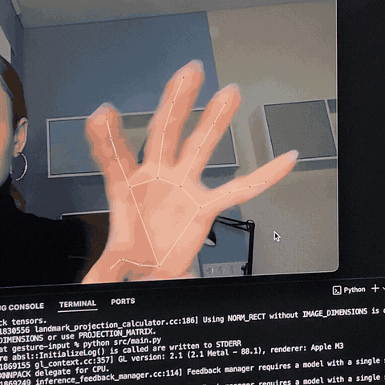

# Hand Gesture Mouse Control

Control your mouse cursor with hand gestures captured by a webcam. The project tracks hand position in real time using [MediaPipe Hands](https://ai.google.dev/edge/mediapipe/solutions/vision/hand_landmarker), recognizes gestures, and translates them into cursor movement and clicks via `pyautogui`.



## Features

- **Cursor movement** — smooth on-screen motion with interpolation and jitter reduction
- **Left click** — two-step "aim → tap" gesture
- **Real-time tracking** — hand skeleton overlaid on the live camera feed
- **Mirrored view** — the camera feed is flipped horizontally so movements feel natural

## Gestures

| Gesture | Description | Action |
|---------|-------------|--------|
| **Pinch** | Thumb, index, and middle fingers pinched together | Cursor follows the midpoint between the thumb and middle finger |
| **Ready** | Index finger extended away from the "base" (midpoint of thumb and middle finger) | Arms the click — the system registers the position |
| **Click** | Index finger snaps down toward the base after Ready | Left mouse click |

> **Tip:** Keep your hand ~40–60 cm from the camera, ensure good lighting, and avoid sudden movements for more reliable recognition.

## How It Works

```
Webcam → HandTracker (MediaPipe) → Gesture recognition → Cursor control
                                              ↓
                                    Background thread (60 FPS)
                                    smooth movement + click
```

- **Main thread** captures frames, detects landmarks, and classifies gestures.
- **Background thread** (`os_actions_handler`) continuously interpolates cursor position along an ease-out bezier curve and fires clicks with a 300 ms cooldown.
- **Screen edges** are easier to reach thanks to a virtual capture area that extends 20% beyond the monitor bounds.

## Requirements

- Python 3.10–3.12 (recommended)
- Webcam
- macOS, Windows, or Linux

> **MediaPipe note:** This code uses the legacy `mediapipe.solutions.hands` API, available in versions **up to 0.10.30**. Starting with 0.10.31 the `solutions` API was removed — on Python 3.13 you will need to migrate to the [MediaPipe Tasks API](https://ai.google.dev/edge/mediapipe/solutions/guide).

## Installation

```bash
git clone https://github.com/<your-username>/gesture-input.git
cd gesture-input

python3 -m venv .venv
source .venv/bin/activate   # Windows: .venv\Scripts\activate

pip install "mediapipe<0.10.31" opencv-python pyautogui numpy
```

## Usage

```bash
source .venv/bin/activate
python src/main.py
```

A **Hand Gesture Control** window will open with the live camera feed. Press **`q`** to quit.

### Webcam check

If the main app fails to open the camera, test it separately first:

```bash
python scripts/test_webcam.py
```

## Permissions (macOS)

The app needs two system permissions to work properly:

1. **Camera** — System Settings → Privacy & Security → Camera → allow for Terminal / Cursor / Python
2. **Accessibility** — required by `pyautogui` to control the mouse: Privacy & Security → Accessibility

## Project Structure

```
gesture-input/
├── media/
│   └── video-gesture-input.gif   # Demo recording
├── scripts/
│   └── test_webcam.py            # Webcam test utility
├── src/
│   ├── main.py                   # Entry point
│   ├── hand_tracking.py          # MediaPipe Hands wrapper
│   ├── gesture_recognition.py    # Pinch, ready, and click detection
│   ├── os_actions.py             # Cursor movement and clicks
│   └── math_utils.py               # Easing and clamp helpers
└── tests/
    ├── test_gesture_recognition.py
    └── test_hand_tracking.py
```

## Tests

```bash
cd tests
python -m unittest discover -s . -p "test_*.py"
```

## Configuration

Gesture recognition thresholds can be tuned in `src/gesture_recognition.py`:

| Parameter | Default | Purpose |
|-----------|---------|---------|
| `threshold` (pinch) | `0.15` | Max distance between fingers to register a pinch |
| `ready_for_click_lookback` | `500` ms | Time window for counting Ready events |
| `ready_for_click_threshold` | `5` | Number of Ready events required before a click |

Cursor movement parameters live in `src/os_actions.py`:

| Parameter | Default | Purpose |
|-----------|---------|---------|
| `screen_margin` | `0.2` | Extends the capture area beyond screen edges |
| `jitter_threshold` | `22` px | Minimum displacement before updating the target |
| `single_move_duration` | `300` ms | Duration of one smooth cursor move |
| `click_cooldown` | `300` ms | Minimum delay between clicks |

## Troubleshooting

| Issue | Fix |
|-------|-----|
| `module 'mediapipe' has no attribute 'solutions'` | Install `mediapipe<0.10.31` or migrate the code to the Tasks API |
| Camera won't open on macOS | Replace `cv2.CAP_DSHOW` with `cv2.VideoCapture(0)` in `src/main.py` |
| Cursor doesn't move | Check Accessibility permission on macOS |
| Clicks fire too often / too rarely | Tune thresholds in `gesture_recognition.py` |

## Stack

- [MediaPipe](https://developers.google.com/mediapipe) — hand landmark detection
- [OpenCV](https://opencv.org/) — video capture and display
- [PyAutoGUI](https://pyautogui.readthedocs.io/) — cursor control and clicks
- [NumPy](https://numpy.org/) — distance calculations and coordinate averaging
